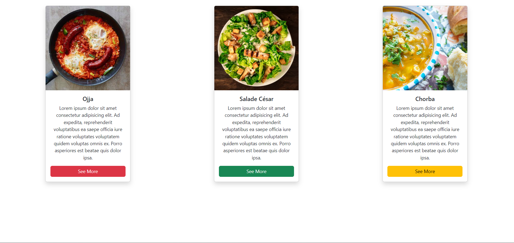
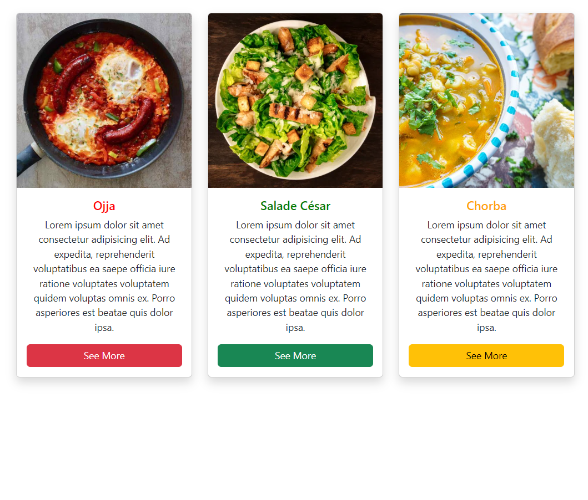

### 4th-round Exercice 

<h1 align="center">Aslema Sfectorians</h1>

    

    <h4 align="right"> اليوم باش نخدمو تمرين صغير</h4>
    <h4 align="right" >    : هاذي باش تكون النتيجة </h4>
    

  

<h4 align="right">المطلوب منكم هو انكم تكملو الكود باش توصلو للنتيجة المطلوبة 
  </h4>
<h4 align="right">
html,css & bootstrap باستعمال 
  </h4>
<h3 align="right">
The design need to be a responsive design and when the screen is  <strong style="color:yellow">less than 992px</strong> the title change the color 
  </h3>

  

    

<h1 align="center">Bon courage 🥳 </h1>

### Resources

- 🔭 Bootstrap [Bootstrap](https://getbootstrap.com/docs/4.0/components/card/)

- 📝 w3-school [w3-school](https://www.w3schools.com/)

